# "万物价格"(Price Anything) 白皮书

**构建去中心化的现实世界价值图层**

---

## 摘要

"万物价格"(Price Anything)是一个革命性的去中心化AR平台，旨在为物理世界构建一个实时、动态、多维度的"价格图层"。通过结合增强现实(AR)、三维重建、人工智能和区块链技术，我们正在创建一个由社区驱动的生态系统，让每个人都能成为现实世界价值的发现者、贡献者和受益者。

本项目超越了传统电商的商品概念，将现实世界中的万事万物——从商品价格、租金成本到服务费用——以AR形式直观呈现，消除市场信息不对称，推动价格信息的去中心化，为未来的虚实融合提供数据基石。

## 1.项目愿景与使命

### 1.1 核心愿景

构建一个共建、共享的现实世界"价值图层"，利用社区的力量打破信息孤岛，让价格信息变得透明、可访问、实时更新。

### 1.1.1 生态系统参与者角色图

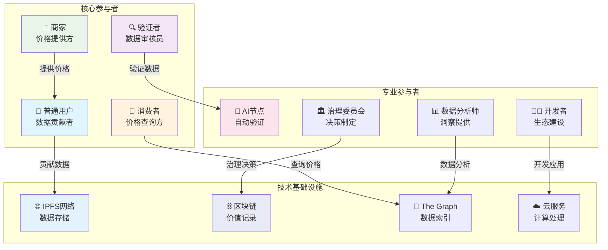

### 1.2 使命宣言

- **信息民主化**: 消除价格信息的不对称性，让每个人都能获得公平的市场信息
- **价值发现**: 通过众包模式发现和标记现实世界中的各种价值
- **社区共建**: 建立一个由贡献者共同拥有和治理的去中心化生态系统
- **技术创新**: 推动AR、3D重建和区块链技术在现实世界应用中的融合创新

### 1.3 解决的核心问题

1.**信息不对称**: 消费者难以获得实时、准确的价格信息
2.**数据孤岛**: 价格信息分散在各个平台，缺乏统一的数据层
3.**价值发现困难**: 许多隐性价值(如服务成本、租金等)缺乏透明度
4.**中心化垄断**: 传统平台控制价格信息，缺乏社区参与和治理

### 1.4 用户体验流程图

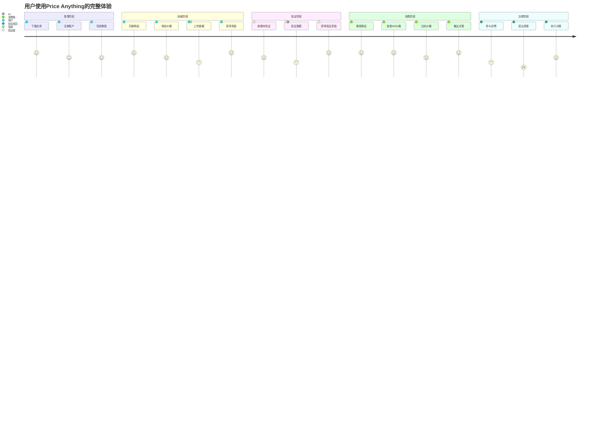

## 2.技术架构

### 2.1 整体架构设计

"万物价格"平台采用三层架构设计：

1.**感知层 (Perception Layer)**: AR设备和移动应用，负责数据采集和用户交互。
2.**处理层 (Processing Layer)**: 3D重建、AI识别和数据验证系统，是平台的核心计算引擎。
3.**存储与信任层 (Storage & Trust Layer)**: 基于IPFS的去中心化存储和区块链治理层，确保数据的安全与共识。

### 2.1.1 详细架构与数据流

为了更清晰地展示系统运作方式，我们设计了如下的详细架构和数据流：

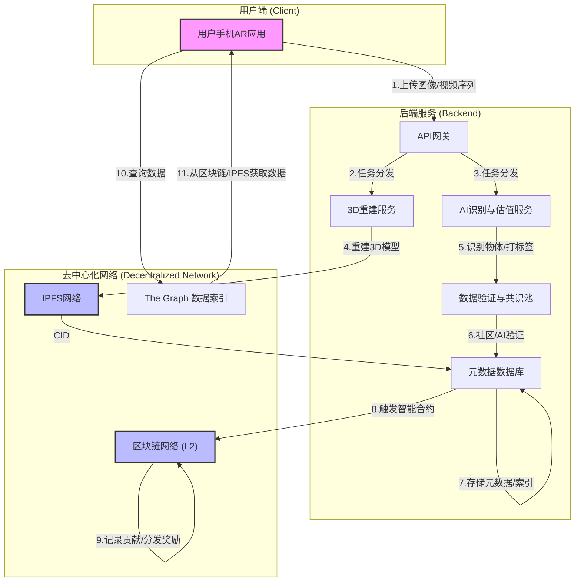

**数据流说明:**

1.**数据采集**: 用户通过AR应用扫描物理环境，捕获一系列带有姿态信息（Pose）的图像或视频流。
2.**上传与分发**: 数据通过API网关上传至后端。网关将3D重建任务和AI识别任务并行分发给相应的微服务。
3.**3D重建**: `3D重建服务` 使用高斯溅射技术处理图像序列，生成场景的3D模型。原始图像和最终模型都将被上传到`IPFS网络`。
4.**AI处理**: `AI识别与估值服务` 对图像进行分析，识别出关键物体，并调用估值模型生成初步的价值标签。
5.**数据验证**: AI生成的标签和用户提交的价值标签会进入`数据验证与共识池`，等待其他用户或AI节点进行交叉验证。
6.**元数据存储**: 一旦数据通过验证，其元数据（包括IPFS的CID、物体ID、价值、验证者信息等）将被存储在`PostgreSQL数据库`中，作为可快速查询的索引。
7.**上链与激励**: `元数据服务`会定期将一批验证过的贡献记录（Merkle Root）提交到`区块链网络`的智能合约中，触发代币奖励的分发。
8.**数据消费**: 当其他用户通过AR应用浏览该场景时，应用会通过`The Graph`等索引服务高效查询区块链和IPFS，将3D模型和价格标签下载并渲染出来。

这个架构将高强度的计算（3D重建、AI）保留在中心化后端以保证效率和低成本，同时将数据所有权和价值共识（IPFS、区块链）置于去中心化网络，实现了性能与去中心化理念的平衡。

### 2.1.2 技术栈架构图

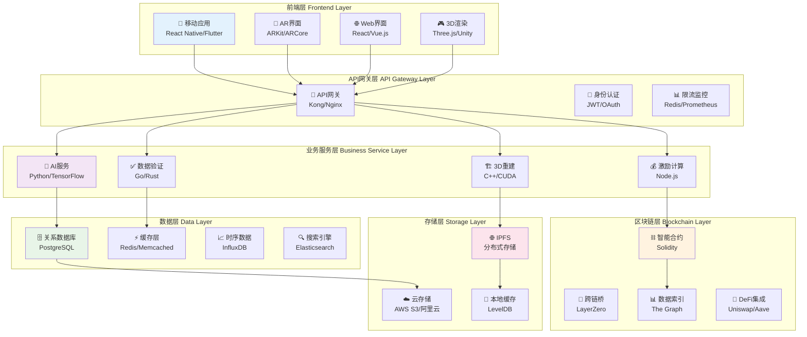

### 2.2 核心技术组件

#### 2.2.1 三维环境感知与建模

**SLAM技术**
- 利用ARKit(iOS)和ARCore(Android)实现同步定位与地图构建
- 实时跟踪设备位置并构建环境的三维地图
- 支持多用户协同建图，提高地图精度和覆盖范围

**3D高斯溅射(3D Gaussian Splatting)**
- 将用户上传的2D图像序列重建为高质量的3D场景
- 相比传统NeRF技术，具有更快的渲染速度和更好的实时性
- 支持动态场景重建和增量更新

**空间计算**
- 理解和处理真实世界的空间信息
- 为价格信息的AR叠加提供精确的空间上下文
- 支持室内外无缝切换的空间定位

#### 2.2.2 智能识别与价值关联

**多模态AI识别**
- 结合视觉识别、文本识别和空间信息的多模态AI系统
- 精准识别三维场景中的各类实体(商品、服务、空间)
- 支持自定义训练模型，适应不同地区和文化的识别需求

**价值语义网络**
- 构建物体、服务和价格之间的语义关联网络
- 支持多维度价格数据(零售价、租金、服务费、劳务成本等)
- 动态学习和更新价格关联规则

**智能估价算法**
- 综合考虑地域、时间、供需关系等因素的动态定价模型
- 支持非标准物品和服务的智能估价
- 持续学习优化，提高估价准确性

#### 2.2.3 去中心化基础设施

**IPFS分布式存储**
- 所有3D数据和价值标签存储在IPFS网络中
- 确保数据的永久性、可访问性和抗审查性
- 支持内容寻址和版本控制

**区块链治理层**
- 基于Arbitrum/Optimism等以太坊L2解决方案
- 低成本、高效率的智能合约执行
- 支持复杂的治理和激励机制

**去中心化身份(DID)**
- 基于区块链的用户身份管理
- 保护用户隐私的同时建立信誉体系
- 支持跨平台的身份验证和数据授权

### 2.3 技术栈选择

#### 前端技术
- **移动端**: React Native/Flutter + ARKit/ARCore
- **3D渲染**: Three.js或原生渲染引擎
- **跨平台兼容**: 一套代码库支持iOS和Android

#### 后端技术
- **编程语言**: Python(AI处理) + Go/Rust(高性能API)
- **数据库**: PostgreSQL(元数据) + Redis(缓存)
- **3D处理**: 3D Gaussian Splatting算法实现

#### Web3技术
- **智能合约**: Solidity + Hardhat/Foundry
- **区块链**: Arbitrum/Optimism
- **存储**: IPFS
- **安全**: OpenZeppelin Contracts

## 3.生态系统设计

### 3.1 三大核心循环

"万物价格"生态系统由三个相互关联、相互促进的动态循环构成：

### 3.1.0 三大核心循环总览图

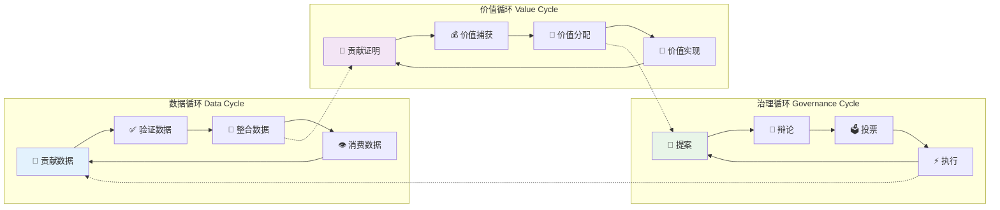

#### 3.1.1 数据循环 - "世界是如何被看见的"

**① 贡献(Contribute)**
- 用户通过AR扫描捕捉3D空间数据和价值标签
- 支持多种价值类型：商品价格、服务成本、租金、工资等
- 自动化的数据预处理和格式标准化

**② 验证(Validate)**
- 多用户交叉验证机制
- AI辅助的异常数据检测
- 基于信誉的验证权重分配

**③ 整合(Integrate)**
- 验证数据整合到全球统一的3D价格地图
- IPFS去中心化存储确保数据永久性
- 实时索引和搜索优化

**④ 消费(Consume)**
- 用户在AR中消费价格数据
- 个性化推荐和价格提醒
- 激励用户贡献新数据，形成正向循环

#### 3.1.2 价值与贡献循环 - "万物皆可挖矿"

**① 贡献证明(Proof of Contribution)**

*数据挖矿*
- 上传3D空间数据和价格信息
- 根据数据质量和稀缺性获得不同奖励
- 支持批量上传和自动化数据采集

*智能挖矿*
- 贡献AI算法和模型改进
- 通过竞赛机制评估模型性能
- 根据模型提升效果获得代币奖励

*社区挖矿*
- 参与社区建设：文档编写、Bug修复、推广等
- DAO赏金任务和社区投票奖励
- 长期贡献者的额外激励机制

**② 价值捕获(Value Capture)**
- 数据API授权费用
- 应用市场收入分成
- 高级功能订阅费用
- 广告和营销服务收入

**③ 价值分配(Value Distribution)**
- 智能合约自动分配代币奖励
- 基于贡献类型和权重的差异化奖励
- 透明的分配算法和实时查询

**④ 价值实现(Value Realization)**
- 代币赋予治理权和收益权
- 二级市场交易和流动性挖矿
- 生态内消费和服务购买

#### 3.1.3 治理循环 - "生态如何进化"

**① 提案(Propose)**
- 任何代币持有者可提出改进建议
- 涵盖协议升级、参数调整、新功能开发等
- 提案模板和标准化流程

**② 辩论(Debate)**
- 社区论坛和社交渠道公开讨论
- 专家意见和技术评估
- 利益相关者的充分表达

**③ 投票(Vote)**
- 基于代币权重的治理投票
- 支持二次方投票等高级投票机制
- 链上和链下投票的结合

**④ 执行(Execute)**
- 社区开发者执行通过的提案
- 透明的开发进度跟踪
- 成功执行增强社区信心

### 3.2 激励机制设计

#### 3.2.1 代币经济模型

**代币总量**: 10亿枚PRICE代币

**代币分配饼图**:

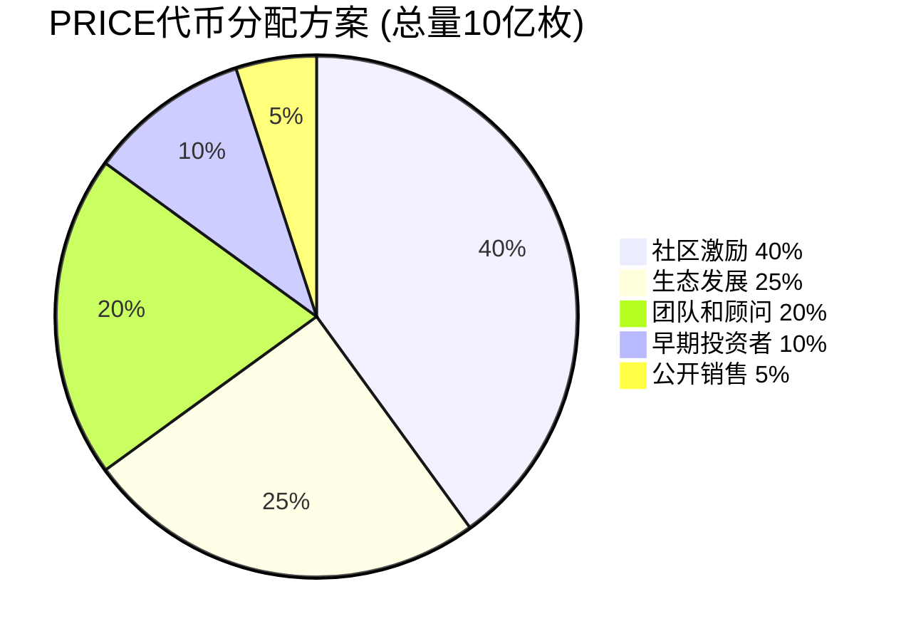

**代币流通机制图**:

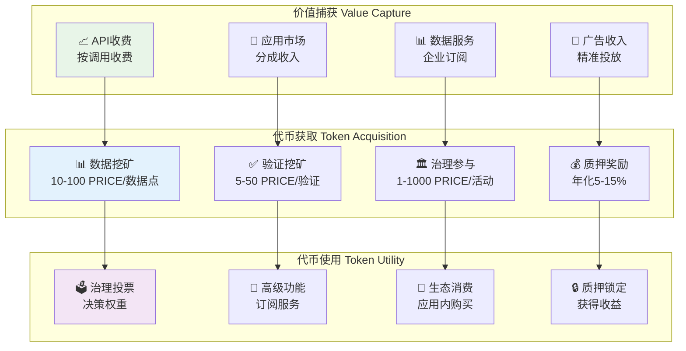

**分配方案**:
- 社区激励: 40% (4亿枚)
- 生态发展: 25% (2.5亿枚)
- 团队和顾问: 20% (2亿枚，4年线性释放)
- 早期投资者: 10% (1亿枚，2年线性释放)
- 公开销售: 5% (0.5亿枚)

**释放机制**:
- 社区激励按贡献实时释放
- 生态发展资金由DAO管理
- 团队和投资者代币锁定释放

#### 3.2.2 挖矿奖励机制

**数据挖矿奖励**
- 基础奖励: 每个有效数据点10-100 PRICE
- 质量加成: 高质量数据额外20%-50%奖励
- 稀缺性加成: 稀缺地区或物品额外50%-200%奖励
- 时效性奖励: 实时更新数据额外10%-30%奖励

**验证奖励**
- 验证正确数据: 5-20 PRICE/次
- 发现错误数据: 20-50 PRICE/次
- 验证准确率影响奖励系数

**治理参与奖励**
- 提案奖励: 100-1000 PRICE(根据提案质量)
- 投票奖励: 1-10 PRICE/次
- 长期持有奖励: 年化5%-15%

### 3.3 质量控制机制

#### 3.3.1 多层验证体系

**自动化验证**
- AI算法检测异常价格和数据
- 地理位置和时间戳验证
- 图像质量和完整性检查

**社区验证**
- 多用户交叉验证机制
- 基于信誉的验证权重
- 争议解决和仲裁机制

**专家验证**
- 特定领域专家的权威验证
- 高价值数据的专业审核
- 定期的数据质量审计

#### 3.3.2 反作弊机制

**行为分析**
- 用户行为模式分析
- 异常活动检测和预警
- 机器人和虚假账户识别

**经济惩罚**
- 虚假数据提交者代币扣除
- 信誉分数降低和权限限制
- 严重违规者永久封禁

**技术防护**
- 设备指纹和生物识别
- 地理位置验证
- 时间戳和数字签名

## 4.商业模式

### 4.1 收入来源

#### 4.1.1 数据服务收入

**API授权费用**
- 向第三方开发者提供数据API
- 按调用次数或数据量收费
- 不同级别的服务套餐

**数据报告服务**
- 定制化的市场分析报告
- 区域价格趋势和消费者行为洞察
- 企业级数据解决方案

**数据授权**
- 向元宇宙平台授权3D数据
- 向地图服务商提供室内导航数据
- 向电商平台提供价格比较数据

#### 4.1.2 平台服务收入

**应用市场**
- 第三方应用的上架费用
- 应用内购买的分成收入
- 高级功能的订阅费用

**广告服务**
- 基于位置和兴趣的精准广告
- 商家推广和品牌合作
- AR广告的创新展示形式

**增值服务**
- 企业版功能和定制开发
- 数据分析和商业智能服务
- 培训和咨询服务

### 4.2 成本结构

#### 4.2.1 技术成本

**研发投入**
- 核心算法和技术开发
- 移动应用和后端系统维护
- 安全审计和漏洞修复

**基础设施成本**
- 云服务和CDN费用
- IPFS节点运营成本
- 区块链交易费用

#### 4.2.2 运营成本

**社区运营**
- 社区管理和用户支持
- 营销推广和品牌建设
- 合作伙伴关系维护

**合规成本**
- 法律咨询和合规审查
- 数据隐私保护措施
- 监管报告和审计

### 4.3 盈利预测

**第一年**: 专注于用户增长和数据积累，预计亏损500万美元
**第二年**: 开始商业化，预计收入200万美元，亏损300万美元
**第三年**: 规模化运营，预计收入1000万美元，实现盈亏平衡
**第四年及以后**: 预计年收入增长50%-100%，净利润率20%-30%

## 5.治理机制

### 5.1 DAO治理结构

#### 5.1.0 DAO治理架构图

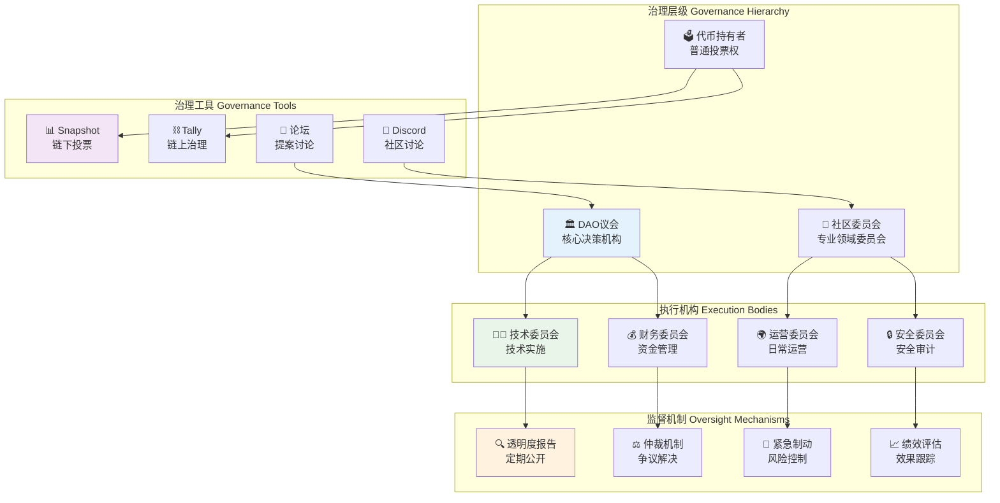

#### 5.1.1 治理代币

**PRICE代币**
- 治理投票权重基于代币持有量
- 支持委托投票机制
- 投票权与贡献度挂钩的动态调整

**治理权限**
- 协议参数调整
- 新功能开发决策
- 资金分配和使用
- 合作伙伴关系建立

#### 5.1.2 治理流程

**治理流程时间线图**:

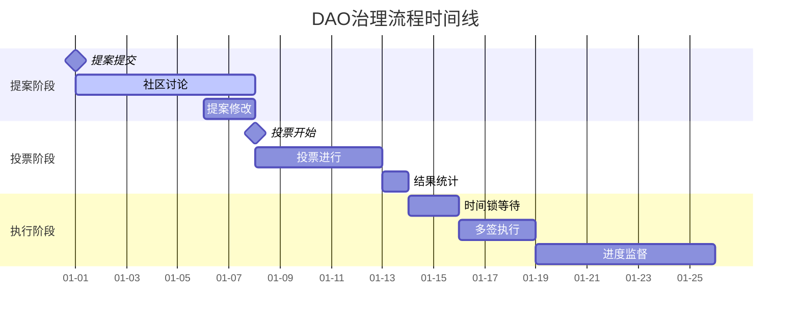

**详细治理流程图**:

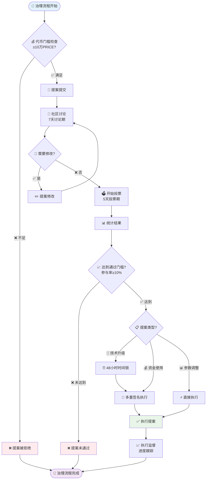

**提案阶段**
- 最低代币门槛: 10万PRICE
- 提案讨论期: 7天
- 社区反馈和修改

**投票阶段**
- 投票期: 5天
- 最低参与率: 10%
- 通过门槛: 简单多数或超级多数(根据提案类型)

**执行阶段**
- 时间锁机制: 重要变更48小时延迟
- 多签执行: 核心团队多重签名
- 执行监督和进度报告

### 5.2 社区治理工具

#### 5.2.1 投票平台

**Snapshot**
- Gas-free的链下投票
- 支持多种投票策略
- 与Discord等社区平台集成

**Tally**
- 链上治理界面
- Governor合约支持
- 提案生命周期管理

#### 5.2.2 讨论平台

**Discord社区**
- 基于代币门控的专属频道
- 实时讨论和意见交流
- 机器人自动化管理

**治理论坛**
- 结构化的提案讨论
- 专家意见和技术评估
- 历史决策记录和追踪

### 5.3 权力制衡机制

#### 5.3.1 多重制衡

**核心团队权限**
- 紧急情况下的快速响应
- 技术实施和日常运营
- 受DAO监督和制约

**社区监督**
- 定期的透明度报告
- 社区审计和质疑权
- 不信任投票机制

#### 5.3.2 渐进式去中心化

**第一阶段**: 核心团队主导，社区参与
**第二阶段**: 共同治理，权力平衡
**第三阶段**: 完全去中心化，社区自治

## 6.风险分析与应对策略

### 6.1 技术风险

#### 6.1.1 技术复杂性风险

**风险描述**
- 3D重建和AR技术的复杂性
- 大规模数据处理的性能挑战
- 跨平台兼容性问题

**应对策略**
- 采用成熟的开源技术栈
- 分阶段开发和测试
- 建立技术专家顾问团队
- 与技术合作伙伴深度合作

#### 6.1.2 安全风险

**风险描述**
- 智能合约漏洞
- 用户数据泄露
- 系统被攻击或滥用

**应对策略**
- 使用经过审计的合约模板
- 定期安全审计和漏洞扫描
- 多重签名和时间锁机制
- 用户数据加密和隐私保护

### 6.2 市场风险

#### 6.2.1 用户采用风险

**风险描述**
- AR技术普及度不足
- 用户学习成本高
- 网络效应难以启动

**应对策略**
- 简化用户界面和操作流程
- 强激励机制吸引早期用户
- 与知名品牌和KOL合作推广
- 提供详细的用户教育和支持

#### 6.2.2 竞争风险

**风险描述**
- 大型科技公司进入市场
- 类似项目的竞争
- 技术被复制和超越

**应对策略**
- 建立技术和数据护城河
- 快速迭代和创新
- 强化社区生态和网络效应
- 专利保护和知识产权布局

### 6.3 监管风险

#### 6.3.1 合规风险

**风险描述**
- 数据隐私法规(GDPR等)
- 加密货币监管政策
- 跨境数据传输限制

**应对策略**
- 建立专业法务团队
- 主动与监管机构沟通
- 设计合规的技术架构
- 分地区的差异化合规策略

#### 6.3.2 政策风险

**风险描述**
- 政府政策变化
- 行业监管收紧
- 国际贸易限制

**应对策略**
- 多元化的地理布局
- 灵活的技术架构设计
- 与政策制定者建立对话
- 准备多种应急预案

### 6.4 经济风险

#### 6.4.1 代币价格波动

**风险描述**
- 加密货币市场波动
- 代币价格大幅下跌
- 影响激励机制效果

**应对策略**
- 多元化的激励机制设计
- 稳定币支付选项
- 代币经济模型的动态调整
- 建立价格稳定基金

#### 6.4.2 资金风险

**风险描述**
- 融资困难
- 现金流不足
- 投资者信心下降

**应对策略**
- 多轮次的融资规划
- 严格的成本控制
- 多元化的收入来源
- 透明的财务管理

## 7.发展路线图

### 7.0 项目发展时间线总览

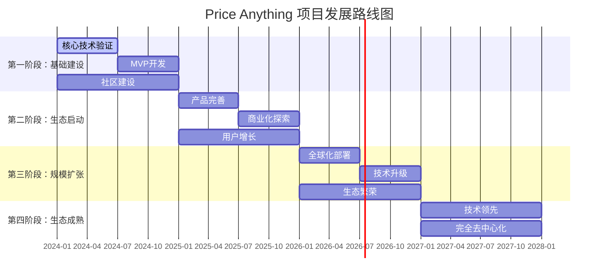

### 7.0.1 里程碑与关键指标图

```mermaid
%%{init: {'flowchart': {'htmlLabels': true, 'curve': 'basis', 'useMaxWidth': true}}}%%
flowchart LR
    subgraph "第一阶段 0-12个月"
        M1["🔬 技术原型<br/>3D重建+AR"]
        M2["📱 MVP发布<br/>iOS/Android"]
        M3["👥 社区启动<br/>1000+用户"]
    end

    subgraph "第二阶段 12-24个月"
        M4["📊 数据积累<br/>100万数据点"]
        M5["💰 商业化<br/>API服务"]
        M6["🚀 用户增长<br/>10万活跃用户"]
    end

    subgraph "第三阶段 24-36个月"
        M7["🌍 全球扩张<br/>多地区部署"]
        M8["🏪 应用市场<br/>第三方生态"]
        M9["💎 用户里程碑<br/>100万活跃用户"]
    end

    subgraph "第四阶段 36个月+"
        M10["🏆 行业领先<br/>技术标准"]
        M11["🏛️ 完全DAO<br/>社区自治"]
        M12["🌟 生态成熟<br/>可持续发展"]
    end

    M1 --> M2 --> M3
    M3 --> M4 --> M5 --> M6
    M6 --> M7 --> M8 --> M9
    M9 --> M10 --> M11 --> M12

    style M1 fill:#e3f2fd
    style M4 fill:#f3e5f5
    style M7 fill:#e8f5e8
    style M10 fill:#fff3e0
```

### 7.1 第一阶段：基础建设 (0-12个月)

#### 7.1.1 技术开发

**Q1-Q2: 核心技术验证**
- 完成3D重建算法的原型开发
- 实现基础的AR功能和物体识别
- 搭建后端API和数据库架构
- 完成智能合约的开发和测试

**Q3-Q4: MVP开发**
- 发布iOS和Android测试版应用
- 实现基础的数据上传和验证功能
- 部署IPFS存储和区块链基础设施
- 完成安全审计和漏洞修复

#### 7.1.2 社区建设

**社区启动**
- 建立Discord和Telegram社区
- 发布白皮书和技术文档
- 招募早期贡献者和测试用户
- 启动社区治理机制

**合作伙伴**
- 与AR技术公司建立合作
- 寻找数据提供商和验证合作伙伴
- 建立学术研究合作关系

### 7.2 第二阶段：生态启动 (12-24个月)

#### 7.2.1 产品完善

**功能扩展**
- 增加更多物体识别类别
- 实现智能估价算法
- 优化AR体验和性能
- 添加社交和分享功能

**数据积累**
- 在主要城市启动数据采集
- 建立数据质量控制体系
- 实现自动化的数据验证
- 达到100万个数据点的目标

#### 7.2.2 商业化探索

**API服务**
- 向第三方开发者开放API
- 建立数据授权和收费机制
- 与电商平台建立合作

**用户增长**
- 实施用户推荐计划
- 与KOL和媒体合作推广
- 参加行业会议和展览
- 目标达到10万活跃用户

### 7.3 第三阶段：规模扩张 (24-36个月)

#### 7.3.1 全球化部署

**地理扩张**
- 扩展到北美和欧洲市场
- 本地化的语言和文化适配
- 建立区域运营团队
- 适应不同地区的法规要求

**技术升级**
- 实现更高精度的3D重建
- 支持更多AR设备和平台
- 优化算法性能和用户体验
- 集成更多AI和机器学习功能

#### 7.3.2 生态繁荣

**开发者生态**
- 建立应用市场和开发者平台
- 提供SDK和开发工具
- 举办黑客马拉松和开发者大会
- 支持第三方应用和服务

**商业模式成熟**
- 实现多元化的收入来源
- 建立稳定的盈利模式
- 扩大企业客户和合作伙伴
- 目标达到100万活跃用户

### 7.4 第四阶段：生态成熟 (36个月以后)

#### 7.4.1 技术领先

**前沿技术**
- 集成最新的AI和AR技术
- 探索VR和元宇宙应用
- 研发下一代的空间计算技术
- 建立技术标准和行业规范

**数据价值**
- 建成全球最大的3D价格数据库
- 提供高价值的数据洞察服务
- 成为行业数据标准的制定者

#### 7.4.2 完全去中心化

**治理成熟**
- 实现完全的社区自治
- 建立可持续的治理机制
- 核心团队逐步退出日常管理
- 社区驱动的创新和发展

**生态自循环**
- 建立自我维持的经济循环
- 实现生态的可持续发展
- 成为Web3基础设施的重要组成部分

## 8.团队介绍

### 8.0 团队组织结构图

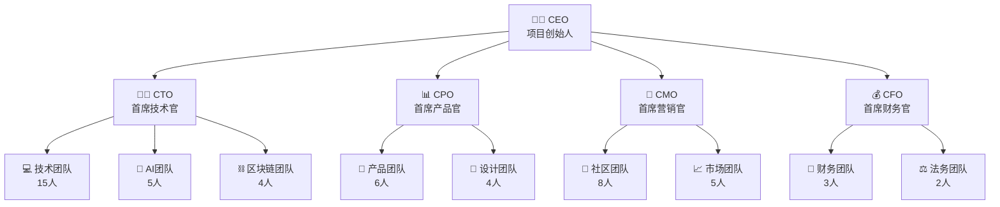

### 8.0.1 团队技能分布图

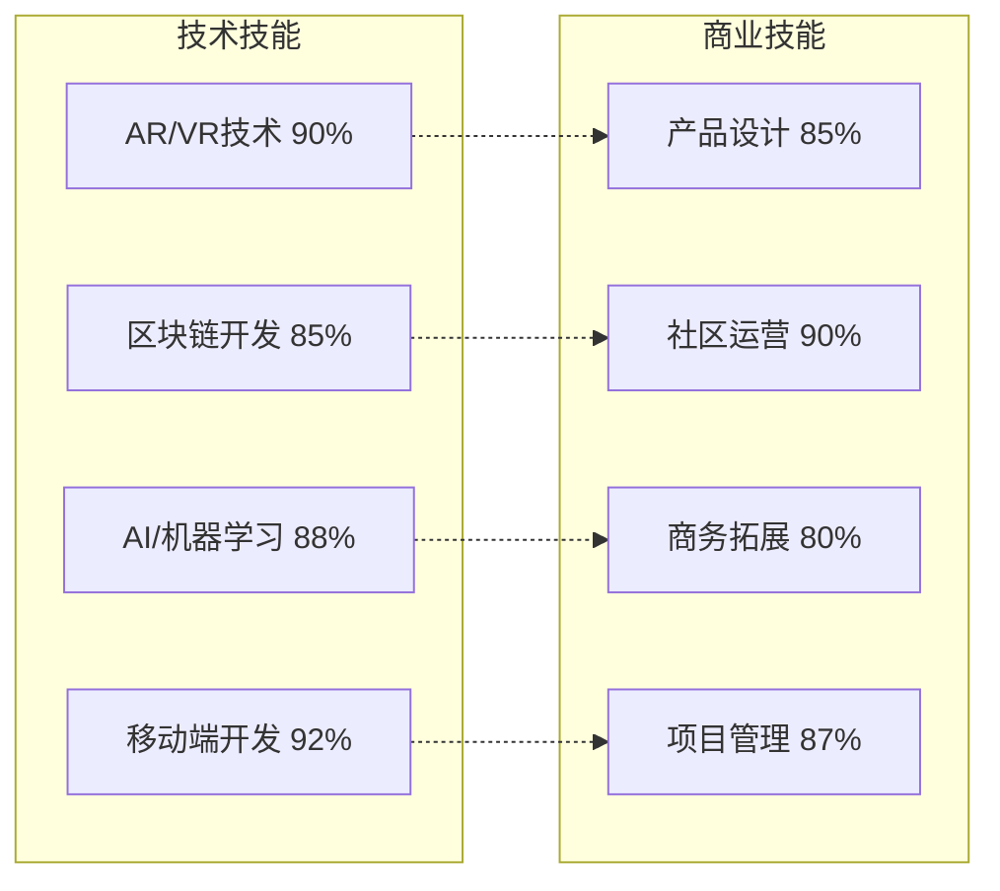

### 8.1 核心团队

#### 8.1.1 技术团队

**首席技术官**
- 10年以上AR/VR开发经验
- 曾在知名科技公司担任技术负责人
- 在3D重建和计算机视觉领域有深厚造诣

**区块链架构师**
- 资深的区块链和智能合约开发专家
- 参与过多个DeFi和DAO项目的开发
- 在去中心化系统设计方面有丰富经验

**AI算法专家**
- 机器学习和计算机视觉博士
- 在顶级会议发表多篇学术论文
- 有丰富的工业界AI应用经验

#### 8.1.2 产品和运营团队

**产品负责人**
- 有成功的移动应用产品经验
- 深度理解用户需求和市场趋势
- 在产品设计和用户体验方面有独特见解

**社区运营总监**
- Web3社区建设和运营专家
- 成功运营过多个千万级用户社区
- 在DAO治理和代币经济设计方面有实战经验

**商务发展总监**
- 有丰富的商务合作和市场拓展经验
- 在AR/VR和区块链行业有广泛的人脉资源
- 成功建立过多个战略合作伙伴关系

### 8.2 顾问团队

#### 8.2.1 技术顾问

**AR技术专家**
- 知名AR公司的创始人
- 在AR技术标准制定中发挥重要作用
- 拥有多项AR相关专利

**区块链专家**
- 以太坊生态的早期贡献者
- 多个知名DeFi协议的技术顾问
- 在去中心化治理方面有深入研究

#### 8.2.2 商业顾问

**投资专家**
- 知名风投合伙人
- 投资过多个成功的Web3项目
- 在项目孵化和商业模式设计方面有丰富经验

**行业专家**
- 零售和电商行业的资深专家
- 对价格数据和市场分析有深入理解
- 在传统行业数字化转型方面有成功案例

### 8.3 招聘计划

#### 8.3.0 团队扩张时间线

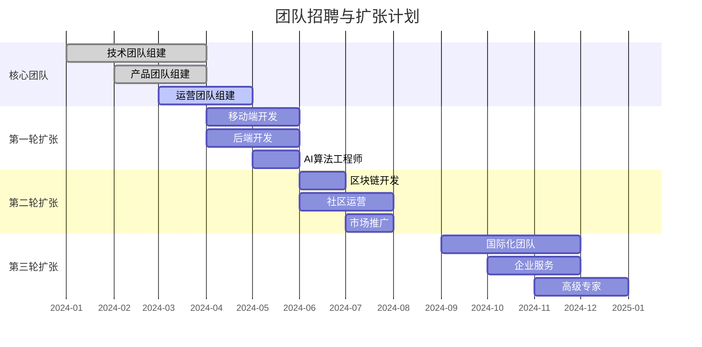

#### 8.3.1 招聘需求分布图

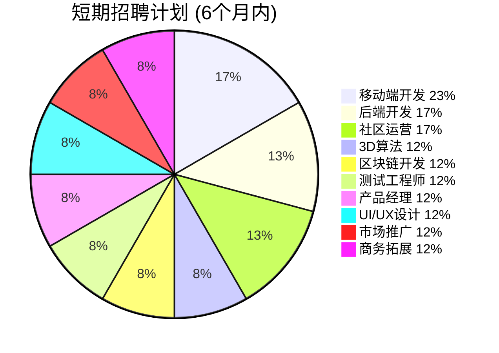

#### 8.3.2 短期招聘 (6个月内)

**技术岗位**
- 移动端开发工程师 (iOS/Android) × 4
- 后端开发工程师 (Go/Python) × 3
- 3D算法工程师 × 2
- 区块链开发工程师 × 2
- 测试工程师 × 2

**非技术岗位**
- 产品经理 × 2
- UI/UX设计师 × 2
- 社区运营 × 3
- 市场推广 × 2
- 商务拓展 × 2

---

## 9. 生态系统全景图

### 9.1 Price Anything 完整生态系统

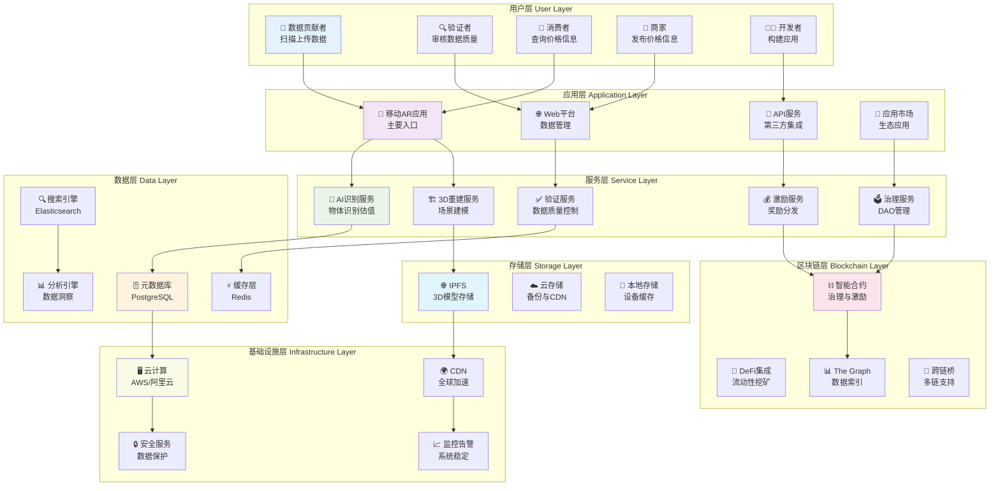

### 9.2 价值流动图

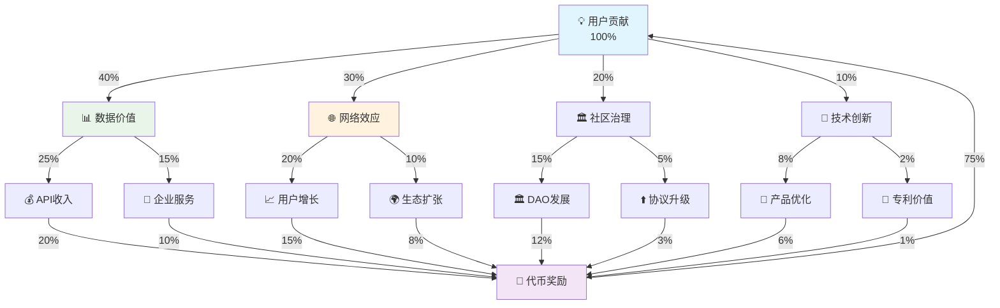

#### 8.3.2 中期招聘 (6-18个月)

**扩张需求**
- 各技术岗位的资深工程师
- 区域运营和本地化团队
- 企业客户服务团队
- 法务和合规专员
- 财务和行政人员

**目标团队规模**: 50-80人

## 9.财务规划

### 9.1 融资计划

#### 9.1.1 种子轮融资

**融资目标**: 300万美元
**估值**: 1500万美元
**用途分配**:
- 技术开发: 40% (120万美元)
- 团队建设: 30% (90万美元)
- 市场推广: 20% (60万美元)
- 运营费用: 10% (30万美元)

**里程碑**:
- 完成MVP开发
- 获得1万测试用户
- 建立基础社区

#### 9.1.2 A轮融资

**融资目标**: 1000万美元
**估值**: 5000万美元
**用途分配**:
- 产品完善和扩展: 35% (350万美元)
- 团队扩张: 25% (250万美元)
- 市场拓展: 25% (250万美元)
- 技术基础设施: 15% (150万美元)

**里程碑**:
- 达到10万活跃用户
- 实现基础商业化
- 完成主要城市覆盖

#### 9.1.3 B轮融资

**融资目标**: 3000万美元
**估值**: 2亿美元
**用途分配**:
- 全球化扩张: 40% (1200万美元)
- 技术研发: 30% (900万美元)
- 生态建设: 20% (600万美元)
- 战略储备: 10% (300万美元)

**里程碑**:
- 达到100万活跃用户
- 实现盈亏平衡
- 建立全球业务网络

### 9.2 成本预算

#### 9.2.1 人力成本

**年度人力成本预算**
- 第一年: 200万美元 (20人团队)
- 第二年: 400万美元 (40人团队)
- 第三年: 600万美元 (60人团队)

**薪酬结构**
- 基础工资: 70%
- 股权激励: 20%
- 代币奖励: 10%

#### 9.2.2 技术成本

**基础设施成本**
- 云服务: 第一年50万美元，后续年增长100%
- IPFS节点: 第一年10万美元，后续年增长50%
- 区块链费用: 第一年5万美元，后续根据使用量调整

**开发工具和服务**
- 软件许可: 年度20万美元
- 第三方服务: 年度30万美元
- 安全审计: 年度50万美元

#### 9.2.3 运营成本

**市场推广**
- 第一年: 100万美元
- 第二年: 200万美元
- 第三年: 300万美元

**日常运营**
- 办公租金: 年度50万美元
- 法务合规: 年度100万美元
- 其他费用: 年度50万美元

### 9.3 收入预测

#### 9.3.1 收入模型

**API服务收入**
- 第二年: 50万美元
- 第三年: 200万美元
- 第四年: 500万美元

**数据授权收入**
- 第二年: 30万美元
- 第三年: 150万美元
- 第四年: 400万美元

**广告和营销收入**
- 第三年: 100万美元
- 第四年: 300万美元
- 第五年: 600万美元

**增值服务收入**
- 第三年: 50万美元
- 第四年: 200万美元
- 第五年: 500万美元

#### 9.3.2 盈利预测

**财务里程碑**
- 第一年: 收入0，亏损500万美元
- 第二年: 收入80万美元，亏损600万美元
- 第三年: 收入500万美元，亏损200万美元
- 第四年: 收入1400万美元，盈利200万美元
- 第五年: 收入2500万美元，盈利800万美元

**关键指标**
- 用户获取成本(CAC): 第一年50美元，逐年降低至10美元
- 用户生命周期价值(LTV): 第三年达到100美元
- LTV/CAC比率: 目标达到10:1

## 10.结论

### 10.1 项目价值主张

"万物价格"项目代表了Web3时代数据民主化和价值共享的重要探索。通过将AR技术、人工智能和区块链技术相结合，我们正在构建一个前所未有的现实世界价值图层，让每个人都能参与到价值发现和共享的过程中。

### 10.2 核心优势

1.**技术创新**: 首次将3D重建、AR和区块链技术深度融合
2.**商业模式**: 可持续的代币经济和多元化收入来源
3.**社区驱动**: 真正的去中心化治理和社区共建
4.**市场机遇**: 抓住AR普及和Web3发展的历史机遇
5.**数据价值**: 构建独特的数据护城河和网络效应

### 10.3 发展愿景

我们的最终愿景是建立一个全球性的、去中心化的现实世界价值网络，让价格信息变得透明、可访问、实时更新。这不仅将改变人们获取和使用价格信息的方式，更将推动整个社会向更加公平、透明、高效的方向发展。

### 10.4 投资价值

对于投资者而言，"万物价格"项目具有以下投资价值：

1.**巨大的市场空间**: 全球价格信息市场规模达数千亿美元
2.**技术壁垒**: 复杂的技术栈形成天然的竞争壁垒
3.**网络效应**: 用户和数据的增长形成强大的网络效应
4.**多元化变现**: 多种收入来源降低商业风险
5.**长期价值**: Web3基础设施的长期价值潜力

### 10.5 社会意义

"万物价格"项目不仅具有商业价值，更具有重要的社会意义：

1.**信息民主化**: 打破价格信息的垄断，让每个人都能获得公平的市场信息
2.**经济效率**: 提高市场透明度，促进资源的优化配置
3.**技术普惠**: 让先进的AR和AI技术服务于普通用户
4.**社区共建**: 建立真正由用户拥有和治理的数字生态系统

### 10.6 行动号召

我们诚邀所有认同我们愿景的投资者、开发者、用户和合作伙伴加入我们的生态系统，共同构建这个属于所有人的现实世界价值图层。让我们一起创造一个更加透明、公平、高效的数字化未来。

---

**联系方式**

- 官方网站: [即将上线]
- 电子邮件: team@priceanything.io
- Discord社区: [即将开放]
- Twitter: @PriceAnything
- GitHub: github.com/price-anything

**免责声明**

本白皮书仅供信息参考，不构成投资建议。加密货币投资存在高风险，投资者应充分了解相关风险并谨慎决策。项目团队将尽最大努力实现白皮书中的目标，但不对最终结果做出保证。

---

*版本: v1.0*  
*发布日期: 2024年*  
*© 2024 Price Anything Team.All rights reserved.*